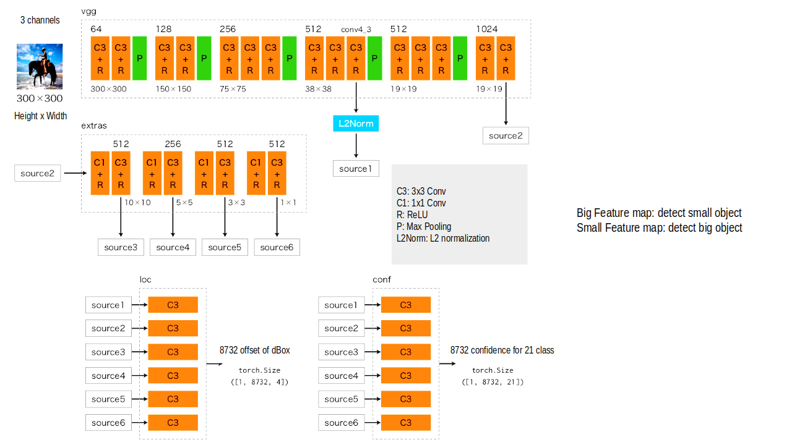

# SSD demo
This project rebuild the SSD model using the PyTorch framework, configuring it for training on various datasets, including custom-created datasets.

  
  SSD model architecture.

## Reference link:
Youtube: https://youtube.com/playlist?list=PLVnyU2MngPdbMX8NmJ5VFwD_g6Al4fH1m&si=4ir4LlEKA5WHxJSo
Github: https://github.com/huutrinh68/dl-pytorch
